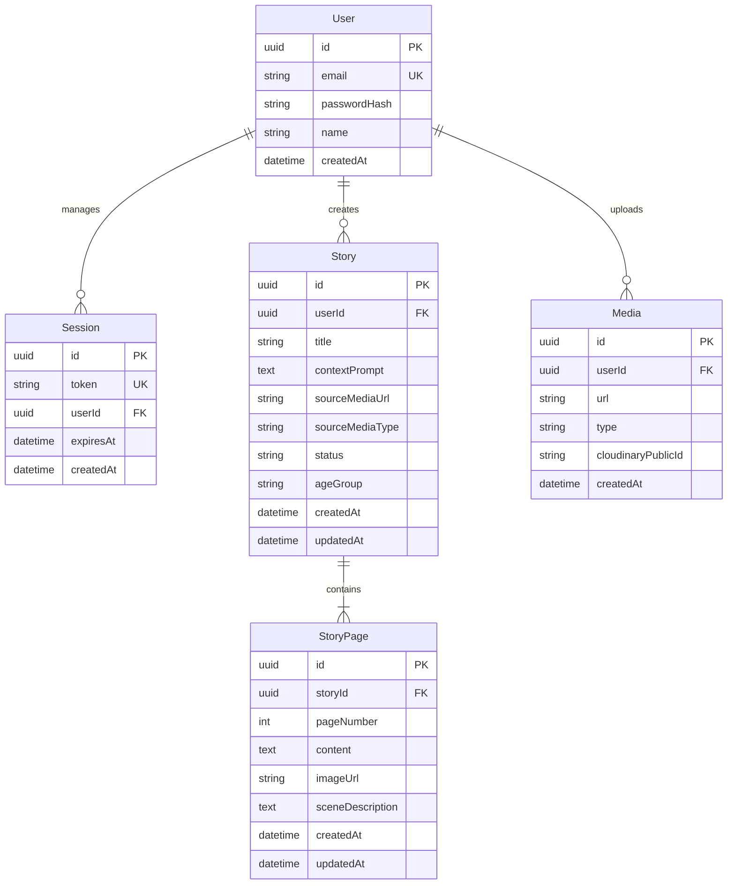

# StoryForge 📖✨

StoryForge is a children's storybook generator application built using **Next.js 14 (App Router)** and **TypeScript**. With StoryForge, parents, educators, and creators can transform a single uploaded drawing or animation and a creative prompt into a structured, age-appropriate, and beautifully illustrated 10-page children's book.

---

## 🚀 Key Features

*   **Gemini 2.5 Flash Integration**: Analyzes uploaded media directly using vision capabilities to formulate the story protagonist's visual cues, styling, and environment.
*   **Age-Tiered Reading Prompts**: Custom-tailored reading levels matching vocabulary complexity, sentence structures, tone constraints, and themes for four specific tiers:
    *   **Toddler (2-3)**: Simple 4-6 word structures, comforting patterns, discovery themes.
    *   **Preschool (4-6)**: Curiously active verbs, direct interaction, emotional learning.
    *   **Early Reader (7-9)**: Cooperative problem solving, sight words, resilience themes.
    *   **Middle Grade (10-12)**: Immersive descriptive vocabulary, idioms, complex story arcs.
*   **Structured 10-Page Arc**: Stories follow a strict narrative layout: Setting & character introduction on Page 1 (based on the upload), buildup (Pages 2-4), rising action (Pages 5-7), Climax (Page 8), Resolution (Page 9), and a satisfying loop ending back to Page 1 (Page 10).
*   **Direct Cloudinary signed uploads**: Optimizes uploads by sending media directly from the client's browser using signed signatures generated on demand, bypassing server bottlenecks.
*   **In-Place Tiptap V3 Editing**: Offers interactive inline rich-text editing per page, backed by automatic database synchronization.
*   **Next-Themes Toggling**: Smooth, class-based dark/light mode toggle mapped using HSL custom properties.

---

## 🛠️ Technology Stack

*   **Framework**: Next.js 14.2.35 (App Router, TypeScript)
*   **Database**: Neon Postgres
*   **ORM**: Prisma ORM (v5.15.0)
*   **Authentication**: Custom secure database-backed session auth (using `bcryptjs` and secure `httpOnly` cookies)
*   **AI Engine**: Google Gemini 2.5 Flash via `@google/generative-ai` (using `v1beta` endpoint configuration for strict JSON formatting)
*   **Media Storage**: Cloudinary (Direct browser uploads)
*   **Editor**: Tiptap v3 (StarterKit)
*   **Styling**: Tailwind CSS + `@tailwindcss/typography`
*   **Icons**: `lucide-react`
*   **Fonts**: Google Inter via `next/font/google`

---

## 🗄️ Database Schema

The database model is mapped directly via Prisma:



---

## ⚙️ Local Setup & Installation

### Prerequisite Environment Settings
Create a `.env` (or `.env.local`) file in the root workspace directory with the following variables:

```env
# Neon Postgres Connection strings
DATABASE_URL="your-neon-pooled-connection-string"
DIRECT_URL="your-neon-direct-connection-string"

# Cloudinary signed uploads key set
CLOUDINARY_CLOUD_NAME="your-cloudinary-cloud-name"
CLOUDINARY_API_KEY="your-cloudinary-api-key"
CLOUDINARY_API_SECRET="your-cloudinary-api-secret"

# Gemini Developer API credentials
GEMINI_API_KEY="your-google-gemini-api-key"

# App Location
NEXT_PUBLIC_APP_URL="http://localhost:3000"
```

### Installation Steps

1.  **Clone and install dependencies**:
    ```bash
    npm install
    ```
2.  **Apply database migrations**:
    ```bash
    npx prisma migrate dev --name init
    ```
3.  **Run compilation build checks**:
    ```bash
    npm run build
    ```
4.  **Start development server**:
    ```bash
    npm run dev
    ```
    Open [http://localhost:3000](http://localhost:3000) on your local browser.

---

## 🛡️ Vercel Production Deployment

To deploy this project to Vercel:

1.  Import your GitHub repository into Vercel.
2.  Add all keys defined in your `.env` as Vercel Environment Variables.
3.  Ensure the build settings use default settings. The `postinstall` script in `package.json` (`prisma generate`) will automatically run and generate the types for `@prisma/client` during the deploy process.
